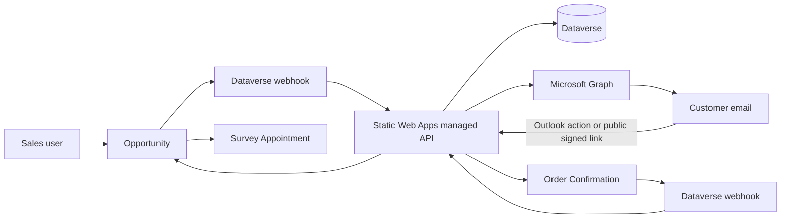
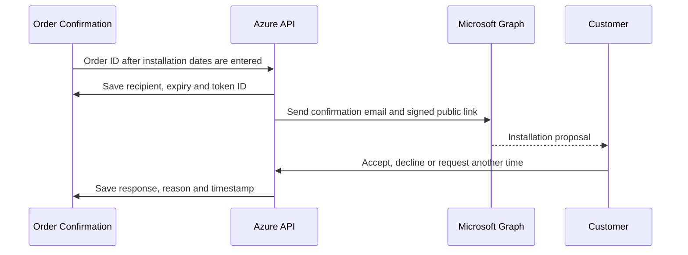

# Demonstration architecture - no new Dataverse tables

## Selected hosting option

Use Azure Static Web Apps Free with a managed HTTP API for the demonstration. The public customer page and HTTPS endpoint are available without Customer Insights/Journeys or Power Pages. Free tier has no SLA and must not be treated as the final production tier.

Do not use SharePoint Framework for the anonymous customer page. SPFx runs inside SharePoint and expects SharePoint authentication. SharePoint Anyone links provide anonymous file/folder sharing, not a general anonymous SPFx application.

## Components



No Survey Session, Installation Session or Region Product Rule table is created.

The webhook uses Dataverse's standard asynchronous `RemoteExecutionContext` body and an `x-automation-key` HTTP header. A manually triggered request remains available for the first smoke test.

## Opportunity survey sequence

```mermaid
sequenceDiagram
  participant O as Opportunity
  participant A as Azure API
  participant G as Microsoft Graph
  participant C as Customer

  O->>A: Opportunity ID
  A->>O: Read customer, Region, surveyor, schedule and Price List
  A->>G: Read surveyor free/busy
  A->>O: Save proposed time, token ID and immutable product snapshot
  A->>O: Create related Appointment
  A->>G: Send HTML email, public form link and optional Outlook card
  G-->>C: Survey email
  C->>A: Accept, decline or reschedule; select products; feedback
  A->>A: Validate signed token and allowed products
  A->>O: Save response, selections, reason and timestamp
```

The demonstration stops here. It deliberately does not create a Quote. Quote conversion can be enabled later after the survey interaction is approved.

## Installation sequence



No Task is created and dates are never automatically overwritten during the demonstration.

## Regional products without a new table

1. Opportunity Price List is used when populated.
2. Otherwise Region's existing Franchise Account is read.
3. The Account's standard Default Price List is used.
4. Standard Price List Items provide Product, Unit and Price.
5. These items are copied into the Opportunity snapshot at email-send time.

This uses standard catalogue tables already present in Dynamics. VAT remains excluded until Finance approves its authoritative source.

## Security model

- Each public URL contains a short-lived signed token containing Opportunity/Order ID, token ID and recipient hash.
- The signed token itself is never stored.
- Submitted product IDs must exist in the immutable Opportunity snapshot.
- Outlook callbacks additionally validate the Microsoft Entra Actionable Messages token.
- HTTPS, CSP, no-store responses and rate limiting are required.
- For an external pilot, add email OTP or obtain formal acceptance of signed-link authentication.

## Demo versus production

| Capability | Demo | Production decision |
|---|---|---|
| Hosting | Static Web Apps Free | Standard/SLA/WAF as required |
| Customer authentication | Signed expiring link | OTP or stronger verification |
| Dataverse storage | Opportunity and Order fields | Retain or introduce audited response entity only if later justified |
| Products | Existing Price Lists | Finance/product governance |
| VAT | Excluded | Finance-owned rule/integration |
| Outlook card | Optional test provider | Organisation/global provider approval |
| Quote generation | Disabled | Enable after UAT |
