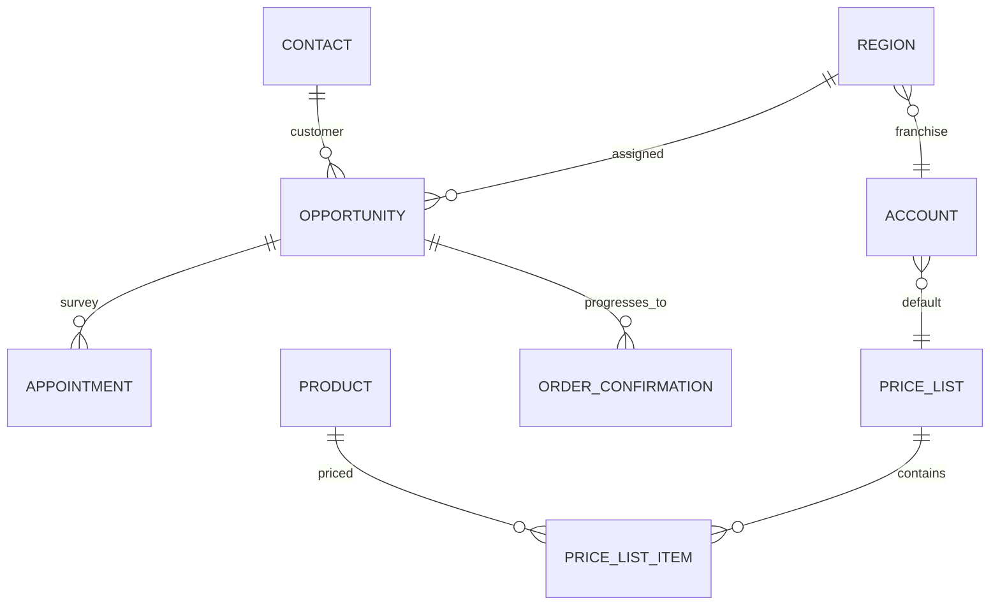

# Dataverse contract - existing tables only

This demonstration creates **no custom tables**. It stores the survey lifecycle on Opportunity and the installation-response lifecycle on Order Confirmation. Contact, Region, Account, Product, Price List, Price List Item and Appointment are read or used through their existing standard/custom records.

## Existing-table model

The Region's existing `ht_franchise` lookup points to Account. The Account's standard Default Price List provides the regional product catalogue when the Opportunity does not already have a Price List.

## Existing columns reused

### Opportunity

- `parentcontactid` - customer
- `ht_region` - Region
- `pricelevelid` - Opportunity Price List
- `ht_surveyor` - Surveyor
- `ht_surveystart`, `ht_surveyfinish` - survey schedule
- `ht_surveyeventid` - created Appointment ID
- `ht_operationalstage` - existing sales stage
- `ht_propertypostcode`, `ht_streetname` - survey address

### Region and Account

- Region `ht_email` - regional sender address
- Region `ht_franchise` - Franchise Account
- Account `defaultpricelevelid` - regional/default product Price List

### Order Confirmation

- `ht_customercontact` - customer
- `ht_region` - Region
- `ht_installationstart`, `ht_installationfinish` - proposed schedule
- `ht_installationstatus` - existing operational installation status

## Columns added to existing Opportunity

These are columns, not tables. Before adding one, confirm that an equivalent column does not already exist.

| Display name | Schema name | Type | Purpose |
|---|---|---|---|
| Survey Automation Status | `ht_SurveyAutomationStatusKey` | Text 50 | `draft`, `sent`, `accepted`, `declined`, `reschedule_requested`, `expired`, `failed` |
| Survey Recipient Email | `ht_SurveyRecipientEmail` | Email | Recipient snapshot |
| Survey Response Expires At | `ht_SurveyExpiresAt` | Date/time | Signed-link expiry |
| Survey Token ID | `ht_SurveyTokenId` | Text 100 | Random identifier; never the signed token |
| Survey Allowed Product IDs | `ht_SurveyAllowedProductIds` | Multiline text | Immutable allowed IDs |
| Survey Products Snapshot | `ht_SurveyProductsSnapshotJson` | Multiline text | Names, quantities and Price List Item prices at send time |
| Survey Selected Product IDs | `ht_SurveySelectedProductIds` | Multiline text | Customer selection |
| Survey Selection Snapshot | `ht_SurveySelectionSnapshotJson` | Multiline text | Selected quantities, unit-price snapshot and product notes |
| Survey Product Review Status | `ht_SurveyProductReviewStatusKey` | Text 30 | `not_received`, `pending_review`, `reviewed`, `rejected` |
| Survey Response Reason | `ht_SurveyResponseReason` | Multiline text | Decline/reschedule/other message |
| Survey Feedback Score | `ht_SurveyFeedbackScore` | Whole number 1-5 | Optional |
| Survey Feedback Comments | `ht_SurveyFeedbackComments` | Multiline text | Optional |
| Survey Responded On | `ht_SurveyRespondedOn` | Date/time | Audit timestamp |
| Survey Automation Last Error | `ht_SurveyAutomationLastError` | Multiline text | Redacted technical message |

## Columns added to existing Order Confirmation

| Display name | Schema name | Type | Purpose |
|---|---|---|---|
| Installation Customer Response | `ht_InstallationResponseKey` | Text 50 | `draft`, `sent`, `accepted`, `declined`, `reschedule_requested`, `expired`, `failed` |
| Installation Recipient Email | `ht_InstallationRecipientEmail` | Email | Recipient snapshot |
| Installation Response Expires At | `ht_InstallationResponseExpiresAt` | Date/time | Signed-link expiry |
| Installation Response Token ID | `ht_InstallationResponseTokenId` | Text 100 | Random token identifier |
| Installation Response Reason | `ht_InstallationResponseReason` | Multiline text | Customer message |
| Installation Responded On | `ht_InstallationRespondedOn` | Date/time | Audit timestamp |

## Scheduling settings outside Dataverse

For this demonstration, time zone, duration and business hours are Azure application settings. The surveyor and surveyor mailbox come from the existing Opportunity `ht_surveyor` lookup and System User email. No Region column is added. `ht_regionid` remains the sole Region identifier.

## Demonstration behaviour

- The email/form reads products and prices from the Opportunity Price List. If absent, it uses Region -> Franchise Account -> Default Price List.
- VAT is not displayed or calculated until Finance approves the authoritative rule.
- The response is saved on Opportunity; no Quote is created in this phase.
- The installation response is saved on Order Confirmation; no Task or additional record is created.
- Product and response snapshots prevent browser tampering and preserve what the customer saw.

## Security

- Application user: read Contact, Region, Account, Product, Price List and Price List Item; read/write Opportunity and Order Confirmation; create/read Appointment.
- Sales users: read response fields; update only fields appropriate to their role.
- Field security: token ID, snapshot JSON and last-error fields.
- Enable auditing on schedules, status, recipient, selected products, reasons and timestamps.
- Never store signed customer tokens or access tokens in Dataverse.
