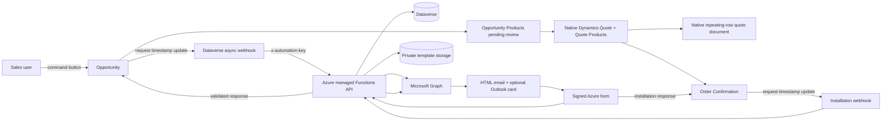

# Survey, regional products, Word documents and installation responses

## End-to-end implementation runbook

Prepared for the HolaTeams development / HolaSales Operations environment. This document is the execution authority for the demonstration and pilot. It does not claim that Azure or Dataverse deployment has already occurred.

## 1. Outcome

Implement one controlled process in which:

1. A sales user qualifies an Enquiry and completes the Opportunity's Contact, Region, Surveyor and Price List context.
2. The user selects **Send Customer Survey** on the Opportunity.
3. Dataverse invokes the Azure API without exposing a secret in browser JavaScript.
4. Azure resolves the Region-specific catalogue, snapshots the allowed products, proposes a survey slot and emails a signed form link.
5. Outlook can additionally show an Adaptive Card for simple actions after provider approval.
6. The customer opens the Azure-hosted form, selects products, enters requested quantities/notes and accepts, declines or requests another time.
7. Azure validates every selection against the immutable snapshot, saves the response and prepares Opportunity Product lines for staff review.
8. A surveyor reviews measurements, quantities, prices and tax in Dynamics.
9. The existing **Create Survey & Quote** command creates the Quote and Quote Products through the supported Dynamics action.
10. A single native Dynamics Word quote template repeats the actual Quote Product rows and displays Dynamics-calculated totals.
11. The existing lifecycle converts the accepted Quote to Order Confirmation.
12. After installation dates are approved, **Send Installation Confirmation** sends a signed form link and optional Outlook card.
13. The customer response is written to the Order Confirmation. A reschedule request never changes dates automatically.
14. Existing installation, fulfilment and invoice processes continue only after the approved status gate.

## 2. Current position and evidence

The repository currently contains:

- 200 successfully exported Zoho Writer DOCX sources. Most are regional variants.
- A prepared TypeScript Azure Functions application and hosted forms.
- Region and lifecycle fields in `HolaTeamsSalesExperience` 1.6.0.0.
- An audited `HolaTeamsOperations` baseline with existing appointment, reminder, email, SMS and fulfilment flows.
- A document renderer that already loops through a `products` array.
- Twelve passing local build/domain tests.

It does **not** currently contain a deployed Azure service, a deployed survey field package, an approved canonical DOCX, customer quantity capture, Opportunity Product creation from the response, approved VAT logic, or an approved Outlook Actionable Message provider.

Inspection of representative Zoho sources found that the product table is not dynamic. For example, Farnborough, Leeds and Wood Green each contain a 54-row table with hard-coded regional product descriptions and prices. Region names and telephone numbers also differ. These files are source evidence, not deployable Dynamics templates.

## 3. Selected architecture



### Document ownership

| Document | Rows come from | Generator | Purpose |
|---|---|---|---|
| Survey worksheet/catalogue | Region-resolved Price List Items | Azure `docxtemplater` | Products available to discuss before final measurements |
| Customer quote | Quote Products | Native Dynamics Word template | Commercial document after surveyor review |
| Installation confirmation | Order and Order Products when needed | Azure email/form; optional native document | Confirm approved installation dates |

Do not use one document as both an indicative survey catalogue and a legally meaningful quote. They may share the same visual master, header and footer, but their data and approval gates differ.

## 4. Non-negotiable implementation rules

1. Dataverse is the system of record for customer, Region, products, pricing, Quote, Order and response state.
2. Product names, prices and VAT must never be hard-coded in JavaScript, Adaptive Cards, HTML or Word templates.
3. Browser JavaScript must never contain `AUTOMATION_INGRESS_KEY`, client secrets or Graph credentials.
4. The public form may return only products present in the send-time snapshot.
5. A customer selection is a request pending staff review, not an accepted final quote.
6. Dynamics native Quote totals are authoritative for the final quote.
7. VAT remains disabled/indicative until Finance approves the source, rate and exception rules.
8. Exactly one automation owns each appointment and outbound message event.
9. Use development and internal recipients first. No production or external send is implicit.
10. Keep the browser form in every email because Outlook cards do not render for every recipient/client.

## 5. Dataverse solution structure

Create or update an unmanaged development solution:

| Setting | Value |
|---|---|
| Display name | HolaTeams Survey Automation Demo |
| Unique name | `HolaTeamsSurveyAutomationDemo` |
| Publisher | Existing HolaTeams publisher |
| Prefix | `ht` |
| Initial version | `1.0.0.0` |

Add only selected table assets. Do not add all assets and do not create a replacement Region, Product, Quote or Order table.

### 5.1 Existing fields to reuse

#### Opportunity

- `parentcontactid`
- `ht_region`
- `ht_surveyor`
- `ht_surveystart`
- `ht_surveyfinish`
- `ht_surveyeventid`
- `ht_operationalstage`
- `ht_propertypostcode`
- `ht_streetname`
- `pricelevelid`

#### Region

- `ht_name`
- `ht_regioncode`
- `ht_email`
- `ht_telephone`
- `ht_franchise`

#### Franchise Account

- `defaultpricelevelid`

#### Order Confirmation (`salesorder`)

- `ht_customercontact`
- `ht_region`
- `ht_installationstart`
- `ht_installationfinish`
- `ht_installationstatus`

### 5.2 Opportunity fields to create

Before creating a column, search by both display name and logical name and reuse an equivalent existing field.

| Display name | Schema name | Type | Configuration / values | Form |
|---|---|---|---|---|
| Survey Send Requested On | `ht_SurveySendRequestedOn` | Date and time | User local | Read-only |
| Survey Automation Status | `ht_SurveyAutomationStatusKey` | Text 50 | `requested`, `draft`, `sent`, `accepted`, `declined`, `reschedule_requested`, `expired`, `failed` | Read-only |
| Survey Recipient Email | `ht_SurveyRecipientEmail` | Email 200 | Send-time snapshot | Read-only |
| Survey Response Expires At | `ht_SurveyExpiresAt` | Date/time | Time-zone independent | Read-only |
| Survey Token ID | `ht_SurveyTokenId` | Text 100 | Random ID; never store signed token | Hidden |
| Survey Allowed Product IDs | `ht_SurveyAllowedProductIds` | Multiline 100,000 | Immutable validation list | Hidden |
| Survey Products Snapshot | `ht_SurveyProductsSnapshotJson` | Multiline 1,000,000 | Send-time names, units and prices | Hidden |
| Survey Selected Product IDs | `ht_SurveySelectedProductIds` | Multiline 100,000 | Compatibility/search value | Read-only |
| Survey Selection Snapshot | `ht_SurveySelectionSnapshotJson` | Multiline 1,000,000 | Selected IDs, quantities, unit prices and notes | Hidden/admin |
| Survey Product Review Status | `ht_SurveyProductReviewStatusKey` | Text 30 | `not_received`, `pending_review`, `reviewed`, `rejected` | Read-only |
| Survey Response Reason | `ht_SurveyResponseReason` | Multiline 4,000 | Decline/reschedule note | Read-only |
| Survey Feedback Score | `ht_SurveyFeedbackScore` | Whole number | Minimum 1, maximum 5 | Read-only |
| Survey Feedback Comments | `ht_SurveyFeedbackComments` | Multiline 4,000 | Customer feedback | Read-only |
| Survey Responded On | `ht_SurveyRespondedOn` | Date/time | User local | Read-only |
| Survey Document Reference | `ht_SurveyDocumentReference` | Text 500 | Optional private document/blob reference | Read-only |
| Survey Automation Last Error | `ht_SurveyAutomationLastError` | Multiline 4,000 | Redacted technical error | Admin only |

The current code expects the status key as text. Changing it to a Dataverse Choice is a valid later hardening change, but requires mapping numeric values in the API first.

### 5.3 Order Confirmation fields to create

| Display name | Schema name | Type | Configuration / values | Form |
|---|---|---|---|---|
| Installation Confirmation Requested On | `ht_InstallationConfirmationRequestedOn` | Date/time | User local | Read-only |
| Installation Customer Response | `ht_InstallationResponseKey` | Text 50 | `requested`, `draft`, `sent`, `accepted`, `declined`, `reschedule_requested`, `expired`, `failed` | Read-only |
| Installation Recipient Email | `ht_InstallationRecipientEmail` | Email 200 | Send-time snapshot | Read-only |
| Installation Response Expires At | `ht_InstallationResponseExpiresAt` | Date/time | Time-zone independent | Read-only |
| Installation Response Token ID | `ht_InstallationResponseTokenId` | Text 100 | Random ID only | Hidden |
| Installation Response Reason | `ht_InstallationResponseReason` | Multiline 4,000 | Customer note | Read-only |
| Installation Responded On | `ht_InstallationRespondedOn` | Date/time | User local | Read-only |
| Installation Response Last Error | `ht_InstallationResponseLastError` | Multiline 4,000 | Redacted error | Admin only |

### 5.4 Price List Item fields to create

These columns allow each Region to control the catalogue without creating a new configuration table.

| Display name | Schema name | Type | Purpose |
|---|---|---|---|
| Show in Customer Survey | `ht_ShowInCustomerSurvey` | Yes/No, default Yes | Exclude internal or retired entries |
| Survey Display Order | `ht_SurveyDisplayOrder` | Whole number | Stable customer/document ordering |
| Survey Customer Description | `ht_SurveyCustomerDescription` | Multiline 1,000 | Regional customer-facing wording |
| Survey Price Display Text | `ht_SurveyPriceDisplayText` | Text 100 | Optional `From`, `per m²`, or `size dependent` label |
| Survey Price Is Indicative | `ht_SurveyPriceIsIndicative` | Yes/No, default No | Prevent an indicative value being treated as final |

The numeric standard Price List Item `amount` remains the machine-readable unit price. Display text supplements it; it must not replace the numeric price used by Dynamics calculations.

### 5.5 Optional Opportunity Product audit fields

Add only if Operations needs to distinguish customer requests from staff-entered lines:

| Display name | Schema name | Type | Purpose |
|---|---|---|---|
| Customer Requested | `ht_CustomerRequested` | Yes/No | Line originated from the Azure survey |
| Customer Requested Quantity | `ht_CustomerRequestedQuantity` | Decimal | Original requested quantity before staff review |
| Survey Selection Note | `ht_SurveySelectionNote` | Multiline 1,000 | Product-specific customer note |

## 6. Security, auditing and ownership

1. Enable auditing on request timestamps, recipient, status, expiry, selected products, reasons and response timestamps.
2. Apply field security to token ID, allowed IDs, JSON snapshots, document reference and last-error fields.
3. Normal sales users receive read access to automation status and response fields, but not token/snapshot fields.
4. The Dataverse application user receives:
   - Read: Contact, Region, Account, Product, Unit, Price List and Price List Item.
   - Read/write: Opportunity and Order Confirmation automation fields.
   - Create/read/write as approved: Appointment and Opportunity Product.
   - No delete permission on Opportunity, Quote, Order or customer records.
5. Assign one solution/component owner for each form, field, webhook, command and flow.

## 7. Configure products and regional Price Lists

Perform this before testing the Azure form.

### 7.1 Product master

1. Deduplicate and activate the approved global Product records.
2. Give every Product a stable product number, name, customer description and default unit.
3. Create/verify Unit Groups and Units such as Each, metre and square metre.
4. Do not create separate Product records merely because two Regions charge different prices.

### 7.2 Regional Price Lists

For every Region:

1. Decide whether it shares a Price List or needs its own.
2. Create/activate the approved Price List in the correct currency.
3. Add one Price List Item per offered Product/Unit combination.
4. Set the numeric amount.
5. Set **Show in Customer Survey**.
6. Set a unique **Survey Display Order**, preferably in increments of 10.
7. Add regional customer wording and price qualifier where needed.
8. Set **Survey Price Is Indicative** for `From`, measured or size-dependent products.
9. Set the Franchise Account's standard `defaultpricelevelid` to that Price List.
10. Confirm the Region's `ht_franchise` lookup points to the correct Franchise Account.

### 7.3 Resolution rule

The API resolves products in this order:

1. Opportunity `pricelevelid`, if populated.
2. Otherwise Opportunity Region.
3. Region `ht_franchise`.
4. Franchise Account `defaultpricelevelid`.
5. Active Price List Items where `ht_ShowInCustomerSurvey = true`.
6. Order by `ht_SurveyDisplayOrder`, then Product name.

Failure to resolve exactly one approved Price List stops the send and records a safe error. Never fall back to a hard-coded price.

## 8. Form changes

### 8.1 Opportunity form

1. Add a collapsed section **Customer Survey Automation** below Survey Details.
2. Add these read-only controls:
   - Survey Automation Status
   - Survey Send Requested On
   - Survey Recipient Email
   - Survey Response Expires At
   - Survey Selected Product IDs
   - Survey Product Review Status
   - Survey Response Reason
   - Survey Feedback Score
   - Survey Feedback Comments
   - Survey Responded On
3. Keep token ID, allowed IDs, JSON snapshots and last error off the normal form.
4. Keep/add the Opportunity Products subgrid below the response section.
5. Create a staff view **Customer-requested products pending review** if the optional audit columns are used.
6. Publish and test with Sales and Surveyor personas, not only System Administrator.

### 8.2 Order Confirmation form

1. Add **Customer Installation Confirmation** below Installation Details.
2. Add these read-only controls:
   - Installation Customer Response
   - Installation Confirmation Requested On
   - Installation Recipient Email
   - Installation Response Expires At
   - Installation Response Reason
   - Installation Responded On
3. Keep token ID and last error off the normal form.
4. Publish and test with Installation and Operations personas.

## 9. Command buttons and secure JavaScript pattern

Create one JavaScript web resource, for example `ht_surveyautomationcommands.js`, in `HolaTeamsSurveyAutomationDemo`. Add it to the existing command-bar solution ownership model.

### 9.1 Buttons

| Table | Button | Function | Server trigger |
|---|---|---|---|
| Opportunity | Send Customer Survey | `HT.SurveyAutomation.requestSurvey` | Update `ht_surveysendrequestedon` |
| Opportunity | Refresh Survey Status | Native form refresh or `HT.SurveyAutomation.refresh` | None |
| Order Confirmation | Send Installation Confirmation | `HT.SurveyAutomation.requestInstallation` | Update `ht_installationconfirmationrequestedon` |

The button writes a request timestamp through `Xrm.WebApi`. It does not call Azure directly and does not possess the webhook key.

### 9.2 JavaScript implementation

```javascript
var HT = window.HT || {};
HT.SurveyAutomation = (function () {
    "use strict";

    function id(value) {
        return String(value || "").replace(/[{}]/g, "");
    }

    function value(formContext, name) {
        var attribute = formContext.getAttribute(name);
        return attribute ? attribute.getValue() : null;
    }

    async function saveIfDirty(formContext) {
        if (formContext.data.entity.getIsDirty()) {
            await formContext.data.save();
        }
    }

    async function requestSurvey(primaryControl) {
        var formContext = primaryControl;
        try {
            if (formContext.ui.getFormType() === 1) {
                throw new Error("Save the Opportunity before requesting the survey.");
            }
            if (!value(formContext, "parentcontactid")) throw new Error("Contact is required.");
            if (!value(formContext, "ht_region")) throw new Error("Region is required.");
            if (!value(formContext, "ht_surveyor")) throw new Error("Surveyor is required.");

            Xrm.Utility.showProgressIndicator("Requesting customer survey...");
            await saveIfDirty(formContext);
            await Xrm.WebApi.updateRecord(
                "opportunity",
                id(formContext.data.entity.getId()),
                { ht_surveysendrequestedon: new Date().toISOString() }
            );
            await formContext.data.refresh(false);
            await Xrm.Navigation.openAlertDialog({
                text: "Survey request accepted. Refresh the record shortly to see Sent or Failed status."
            });
        } catch (error) {
            await Xrm.Navigation.openErrorDialog({ message: error.message || String(error) });
        } finally {
            Xrm.Utility.closeProgressIndicator();
        }
    }

    async function requestInstallation(primaryControl) {
        var formContext = primaryControl;
        try {
            if (formContext.ui.getFormType() === 1) {
                throw new Error("Save the Order Confirmation first.");
            }
            if (!value(formContext, "ht_customercontact")) throw new Error("Customer Contact is required.");
            if (!value(formContext, "ht_installationstart")) throw new Error("Installation Start is required.");
            if (!value(formContext, "ht_installationfinish")) throw new Error("Installation Finish is required.");

            Xrm.Utility.showProgressIndicator("Requesting installation confirmation...");
            await saveIfDirty(formContext);
            await Xrm.WebApi.updateRecord(
                "salesorder",
                id(formContext.data.entity.getId()),
                { ht_installationconfirmationrequestedon: new Date().toISOString() }
            );
            await formContext.data.refresh(false);
            await Xrm.Navigation.openAlertDialog({
                text: "Installation confirmation request accepted. Refresh shortly to see Sent or Failed status."
            });
        } catch (error) {
            await Xrm.Navigation.openErrorDialog({ message: error.message || String(error) });
        } finally {
            Xrm.Utility.closeProgressIndicator();
        }
    }

    async function refresh(primaryControl) {
        await primaryControl.data.refresh(false);
    }

    return {
        requestSurvey: requestSurvey,
        requestInstallation: requestInstallation,
        refresh: refresh
    };
})();
```

### 9.3 Command rules

- Pass `PrimaryControl` to each JavaScript function.
- Show **Send Customer Survey** only on an existing Opportunity.
- Disable while status is `requested` or `draft`.
- Require an explicit resend/revoke design before allowing a second send after `sent` or `accepted`.
- Show **Send Installation Confirmation** only when start and finish are populated and finish is after start.
- Server-side validation remains authoritative; command visibility is convenience only.

## 10. Dataverse-to-Azure trigger configuration

Use asynchronous post-operation Dataverse webhooks for the pilot.

### 10.1 Webhook registration

Create two HTTPS webhooks with `HttpHeader` authentication:

```text
x-automation-key: <same secret as Azure AUTOMATION_INGRESS_KEY>
```

Register:

| Endpoint | Message/table | Filtering attribute | Execution |
|---|---|---|---|
| `/api/events/opportunity-ready` | Update / Opportunity | `ht_surveysendrequestedon` | Post-operation, asynchronous |
| `/api/events/installation-ready` | Update / Order (`salesorder`) | `ht_installationconfirmationrequestedon` | Post-operation, asynchronous |

Use request timestamps instead of broad Create/Update triggers. This prevents incomplete records and installation-date edits from accidentally emailing a customer.

### 10.2 Idempotency

- The Opportunity/Order stores the token ID and status.
- Repeated webhook delivery returns the existing open session rather than sending a duplicate.
- A deliberate resend must rotate the token ID, expire the old session and record a new request timestamp.
- Configure successful development System Jobs for deletion only after evidence collection requirements are agreed.

### 10.3 Existing flow conflict review

Before enabling either step, review these existing activated flows:

- CRM - Opportunity - Create Survey Appointment
- CRM - Opportunity - Send Survey SMS Reminder
- CRM - Order - Create Installation Appointment
- CRM - Order - Update Installation Appointment
- CRM - Order - Send Installation SMS Reminder
- CRM - Opportunity - Send Installation Feedback

For each event, choose one authoritative writer. Filter, disable or refactor duplicates in the development solution. Never let both an existing flow and Azure create the same Appointment or send the same customer communication.

## 11. Azure form and API implementation

### 11.1 Existing endpoints

| Endpoint | Purpose |
|---|---|
| `POST /api/events/opportunity-ready` | Start/idempotently reuse survey request |
| `GET|POST /api/survey/{token}` | Render and submit customer survey |
| `POST /api/action/survey` | Receive Outlook `Action.Http` survey action |
| `POST /api/events/installation-ready` | Start/idempotently reuse installation request |
| `GET|POST /api/installation/{token}` | Render and submit installation response |
| `POST /api/action/installation` | Receive Outlook installation action |
| `GET /api/health` | Liveness check |

### 11.2 Required code completion for this expanded scope

The current package needs these additions before quantity/totals UAT:

1. `src/infrastructure/dataverse.ts`
   - Query `ht_telephone` with Region.
   - Query the five survey display fields with Price List Items.
   - Filter active/survey-enabled items.
   - Add deterministic `$orderby`.
   - Add idempotent create/update logic for customer-requested Opportunity Products.
2. `src/domain/models.ts`
   - Add `ProductSelection { productId, quantity, note? }`.
   - Add regional telephone and price-display metadata.
3. `src/functions/surveyForm.ts`
   - Add decimal quantity and optional product note controls.
   - Disable quantity when the product is unchecked.
   - Parse by product ID; never trust submitted price/name.
4. `src/domain/rules.ts`
   - Validate quantity by Unit and approved minimum/maximum.
   - Reject duplicate, unknown, inactive or snapshot-mismatched IDs.
5. `src/services/surveyAutomation.ts`
   - Save selection JSON.
   - Set product review status to `pending_review`.
   - Upsert requested Opportunity Product lines or queue them for explicit staff application.
   - Never create the final Quote automatically in the first pilot.
6. `src/infrastructure/documents.ts`
   - Add Region phone/email.
   - Add price qualifier and unit.
   - Add `line_net`, `subtotal`, approved VAT and `grand_total` only when calculation is authoritative.
   - Format money and dates in `en-GB` / Europe-London.
7. Tests
   - Add zero, one and many product rows.
   - Add decimal quantities, tampered quantities and duplicate product tests.
   - Add regional catalogue separation and exact total rounding tests.

### 11.3 Product response contract

Conceptual API value after parsing the HTML form:

```json
{
  "response": "accepted",
  "items": [
    {
      "productId": "00000000-0000-0000-0000-000000000000",
      "quantity": 12.5,
      "note": "Approximate loft area; surveyor to confirm"
    }
  ],
  "reason": "",
  "feedbackScore": 5,
  "feedbackComments": ""
}
```

The server resolves name, Unit and price from the stored snapshot. Browser-submitted money, VAT and total values are ignored.

## 12. Dynamic Word implementation

### 12.1 Canonical survey worksheet generated by Azure

1. Select the closest approved Zoho DOCX as the visual source.
2. Remove hard-coded Region, telephone, products and prices.
3. Preserve the common logo, page layout, fixed labels, table headers and footer.
4. Replace customer/Region fields with tags:

```text
{customer_name}
{customer_email}
{customer_mobile}
{opportunity_name}
{region_name}
{region_telephone}
{property_postcode}
{street_name}
{survey_start}
```

5. Keep one product row and make it a `docxtemplater` loop. A typical row is:

```text
{#products}{display_order} | {name} | {description} | {price_display} | {unit} | {quantity} | {line_net}{/products}
```

6. Keep the total area fixed below the loop:

```text
Subtotal: {subtotal}
VAT: {vat_total}
Total: {grand_total}
```

7. Until Finance approves VAT and measurements, label the document **Survey worksheet / indicative prices — not a quotation** and leave authoritative totals out.
8. Upload the template to the private blob path `document-templates/survey/survey-template.docx`.
9. Enable document generation only after the template passes 0/1/many-row visual tests.

### 12.2 Native Dynamics quote Word template

Use this after staff review and Quote creation:

1. In Power Platform admin center open Environment > Settings > Templates > Document templates.
2. Select **New > Download Word Template**.
3. Select the Quote table.
4. Select only the required relationships, including Quote Products and required customer/Region lookups.
5. Download the template from the same environment in which it will be used.
6. In desktop Word enable Developer and open the XML Mapping Pane.
7. Select the `urn:microsoft-crm/document-template/...` XML part.
8. Add Quote/customer/Region fields as Plain Text or Picture controls.
9. Create one product table data row containing Product, Description, Unit Price, Quantity, Discount, Tax and Extended Amount.
10. Select the entire data row and mark the Quote Products relationship as **Repeating**.
11. Map the fixed total section to Quote totals such as line amount, discount, tax and total amount.
12. Save and upload it as an organisational Word template.
13. Generate it from test Quotes containing 0, 1, 2 and at least 25 lines.

Microsoft documents that repeating relationship data should be placed in a table row and the entire row marked Repeating. Native templates return at most 100 records per selected relationship and may order related records by creation time. Therefore, use Azure generation when exact catalogue ordering is essential, and use the native Quote template for reviewed commercial lines.

Word templates are environment-bound. Retain the source master and repeat the supported download/bind/upload procedure in each target environment rather than assuming the development binding will work elsewhere.

### 12.3 Do not select Power Automate Word connector by default

The Word Online (Business) connector supports repeating arrays, but it is Premium in Power Automate and has file/control limitations. The current Azure renderer avoids adding that dependency. Select it only if licensing, SharePoint storage and operating ownership are explicitly approved.

## 13. Azure resources and configuration

### 13.1 Demonstration resources

Create in the approved development subscription/resource group:

- Azure Static Web Apps Free for static content and managed HTTP Functions.
- Storage Account, Standard LRS, HTTPS-only.
- Private blob container `document-templates`.
- Optional Application Insights/Log Analytics path supported by the selected hosting plan; production hosting must include full telemetry.

Static Web Apps Free has no SLA. Use Standard/Function App plus managed identity, WAF/APIM and operational monitoring for production if required by the security review.

### 13.2 Required environment variables

```text
DATAVERSE_URL
GRAPH_SENDER_MAILBOX
PUBLIC_BASE_URL
AZURE_TENANT_ID
AZURE_CLIENT_ID
AZURE_CLIENT_SECRET
SURVEY_TOKEN_SECRET
AUTOMATION_INGRESS_KEY
DEFAULT_SURVEY_DURATION_MINUTES
SURVEY_BUSINESS_START_HOUR
SURVEY_BUSINESS_END_HOUR
DEFAULT_TIME_ZONE
ENABLE_WORD_DOCUMENT
TEMPLATE_STORAGE_URL
TEMPLATE_CONTAINER
SURVEY_TEMPLATE_BLOB
ENABLE_ACTIONABLE_MESSAGES
ACTIONABLE_APP_ID_URI
ACTIONABLE_ORIGINATOR_ID
ACTIONABLE_ALLOWED_TENANTS
ACTIONABLE_ALLOW_GLOBAL_TENANTS
```

Initial deployment values:

```text
ENABLE_WORD_DOCUMENT=false
ENABLE_ACTIONABLE_MESSAGES=false
ACTIONABLE_ALLOW_GLOBAL_TENANTS=false
```

Enable one optional capability at a time after the link-only process passes.

### 13.3 Deployment paths

When the repository root is `Node Application`:

| Setting | Value |
|---|---|
| App location | `azure-survey-automation/web` |
| API location | `azure-survey-automation` |
| Output location | `web` |
| Runtime | Node.js 20 |

Run before every deployment:

```powershell
Set-Location "C:\Work\HolaTeams\Access4Lofts\Zoho CRM\Node Application\azure-survey-automation"
npm.cmd install
npm.cmd run check
```

## 14. Microsoft Entra, Graph and storage permissions

Create a single-tenant application for the development pilot.

### 14.1 Graph application permissions

- `Mail.Send`
- `Calendars.ReadBasic.All` for app-only basic calendar/free-busy access

Grant admin consent and restrict application access to the approved sender/surveyor mailboxes using Exchange application RBAC/access policy.

### 14.2 Dataverse application user

1. Create an application user for the Entra application.
2. Assign only the custom security role described in section 6.
3. Test read/write with a disposable Opportunity before enabling customer email.

### 14.3 Blob access

Assign **Storage Blob Data Reader** to the service principal at the private template container/storage scope. If generated documents are later archived, grant a narrowly scoped writer role and define retention first.

### 14.4 Secrets

- Generate at least 32 random characters for `SURVEY_TOKEN_SECRET`.
- Generate at least 24 random characters for `AUTOMATION_INGRESS_KEY`.
- Never put either secret in JavaScript, source control, Jira or screenshots.
- Rotate the client secret after the demonstration.
- Prefer certificate or managed identity for production.

## 15. Email and Outlook Adaptive Cards

### 15.1 Link-first email

The first successful release sends branded HTML containing:

- Customer name
- Region contact details
- Proposed survey/installation time
- Signed secure form link
- Expiry/support wording

### 15.2 Card enablement

After link-only UAT:

1. Register an Actionable Message provider with Test scope.
2. Configure Microsoft Entra authentication for the callback API.
3. Expose the generated Application ID URI and scope.
4. Pre-authorise the Outlook Actions application ID `48af08dc-f6d2-435f-b2a7-069abd99c086`.
5. Configure the returned Originator ID.
6. Allow only the development tenant initially.
7. Test Outlook web, new/classic desktop and mobile, plus a non-Outlook mailbox.
8. Keep product quantity entry on the full form. The card may show up to 20 product choices for convenience.

Use Adaptive Card 1.0 `Action.Http`, not `Action.Submit`. The callback validates both the Entra action token and the signed survey token and compares the Outlook user email with the original recipient hash.

## 16. Response handling and downstream lifecycle

### 16.1 Survey accepted

1. Validate token, expiry, recipient hash and token ID.
2. Validate product IDs and quantities against the snapshot.
3. Save the immutable selection JSON and response audit fields.
4. Set status `accepted` and product review `pending_review`.
5. Upsert customer-requested Opportunity Product lines, or hold until an explicit staff-apply action if Operations chooses that safer mode.
6. Notify the Opportunity owner/surveyor inside Dynamics.
7. Surveyor confirms measurements, quantities, prices and VAT.
8. Set product review `reviewed`.
9. Enable the existing **Create Survey & Quote** command.
10. Use Dynamics `GenerateQuoteFromOpportunity`, then generate the native Quote Word document.

### 16.2 Survey reschedule requested

1. Save the reason and response timestamp.
2. Create/route a staff task or notification only if approved.
3. Do not alter the Appointment automatically.
4. Staff updates the dates and deliberately issues a new token/send.

### 16.3 Survey declined

Save the response and stop automatic Quote creation. The sales owner chooses the appropriate Opportunity state/stage.

### 16.4 Installation accepted

Save the response on Order Confirmation. Allow existing installation preparation/reminder processes to continue.

### 16.5 Installation reschedule/declined

Save the reason, notify Operations and block automatic installation progression. Never overwrite approved dates from anonymous form input.

## 17. Execution order from zero to pilot

### Phase A — inventory and decisions

1. Select one representative old regional DOCX and one generated control document.
2. Approve the canonical survey worksheet layout.
3. Approve whether quantity is customer-entered or staff-only.
4. Approve regional Price Lists and Units.
5. Decide the VAT authority; otherwise keep VAT/final totals out of the survey worksheet.
6. Name the Dataverse, Azure, M365, Finance and Operations owners.

**Exit:** signed field/data/template decisions.

### Phase B — Dataverse configuration

1. Export an unmanaged backup of current owning solutions.
2. Create the isolated survey automation solution.
3. Add the Opportunity, Order and Price List Item fields.
4. Add form sections and field security profiles.
5. Enable auditing.
6. Add the two command buttons and JavaScript web resource.
7. Publish all customizations.

**Exit:** a test user can request but cannot edit protected response fields.

### Phase C — product/price data

1. Clean Products, Units and regional Price Lists.
2. Link Region to Franchise Account and Account to Default Price List.
3. Configure inclusion, display order, wording and indicative flags.
4. Reconcile prices against the approved old regional document.

**Exit:** one API query returns the exact expected catalogue for each test Region.

### Phase D — Azure base deployment

1. Create Entra app, Dataverse application user and Graph permissions.
2. Create Static Web App and private template storage.
3. Deploy with cards and Word disabled.
4. Configure secrets/environment variables.
5. Test `/api/health`.
6. Manually call both ingress endpoints using internal test records.
7. Complete the hosted form and verify Dataverse response fields.

**Exit:** link-only survey and installation response pass without automation triggers.

### Phase E — dynamic products and Word

1. Complete quantity/selection and Price List Item code changes.
2. Create the canonical loop-tag DOCX.
3. Upload it privately.
4. Assign blob read permission.
5. Enable Word generation.
6. Test 0, 1, multiple and page-overflow product rows.
7. Create and bind the native Dynamics Quote template.
8. Reconcile Quote line totals and generated document totals.

**Exit:** product rows are dynamic and no regional price is hard-coded.

### Phase F — webhook/button integration

1. Register request-timestamp webhooks.
2. Resolve overlapping appointment/email flow ownership.
3. Select **Send Customer Survey** on one internal Opportunity.
4. Confirm exactly one Appointment and one email.
5. Complete the response and review Opportunity Products.
6. Create Quote and generate the quote document.
7. Repeat the installation confirmation path.

**Exit:** one complete internal Enquiry-to-installation scenario with evidence.

### Phase G — Outlook card

1. Register Test provider and configure Entra callback authentication.
2. Enable cards for named test recipients.
3. Test valid, expired, forwarded and already-completed actions.
4. Verify fallback link in every tested client.

**Exit:** card is progressive enhancement, never the only path.

### Phase H — controlled pilot

1. Import managed solution to approved UAT.
2. Rebind environment-specific Word template and connections.
3. Load approved Price Lists/master data.
4. Repeat security, negative and reconciliation tests.
5. Obtain Business, Finance, Security/DPO and M365 approvals.
6. Release to a restricted external pilot and monitor every send/response.

**Exit:** signed UAT and operational handover. Production is a separate gate.

## 18. Minimum test matrix

| Area | Required cases |
|---|---|
| Region resolution | Opportunity Price List; Account fallback; missing list; wrong currency |
| Products | 0, 1, 20, 21+, inactive, excluded, duplicate and tampered ID |
| Quantity | Decimal, zero, negative, excessive, unit mismatch and changed browser value |
| Word | 0/1/many rows, page break, long description, currency, header/footer, regional phone |
| Totals | Discounts, rounding, indicative price, approved VAT, Dynamics-to-document equality |
| Survey token | Valid, expired, wrong token ID, changed recipient, replay after completion |
| Outlook action | Valid tenant, invalid issuer/audience/caller, forwarded email, fallback client |
| Concurrency | Double click, duplicate webhook, two simultaneous submissions |
| Installation | Accept, decline, reschedule, missing dates, finish before start |
| Permissions | Sales, surveyor, installation, app user and unauthorised user |
| Existing automation | Exactly one Appointment/email/SMS and no loop |

## 19. Monitoring, support and rollback

### Monitoring

- Log correlation ID, record ID, operation, result and safe error category.
- Never log tokens, secrets, full email bodies or customer response text unnecessarily.
- Provide views for `requested`, `failed`, expired and pending product-review records.
- Alert on repeated Graph, Dataverse, token-validation and webhook failures.

### Rollback

1. Disable the two SDK message processing steps.
2. Hide/disable the two command buttons.
3. Set cards and Word flags to false.
4. Restore ownership to the previously approved appointment/email flows.
5. Do not delete response evidence or business records.
6. Import the previous managed solution only under the normal release rollback procedure.

## 20. Definition of done

The implementation is done only when:

- No product or regional price is hard-coded in the canonical template or application.
- One Region test proves the direct Opportunity Price List path.
- A second Region proves the Franchise Account default Price List path.
- Customer selections return to Dataverse with immutable snapshots and quantities.
- Opportunity Products are created/applied idempotently and reviewed before Quote creation.
- The Quote document repeats actual Quote Products and matches Dynamics totals.
- Installation accept/decline/reschedule writes to Order Confirmation.
- Exactly one automation owns each Appointment and communication event.
- Link-only email works independently of Outlook cards.
- Security, negative, replay and role tests pass.
- UAT evidence and named approvals exist for the target environment.

## 21. Inputs required from project owners

- Approved development Azure subscription and resource group
- Static Web App name and deployment repository/branch
- One test Opportunity in each of two Regions
- One test Order Confirmation
- Approved sender and surveyor mailboxes
- Approved Product/Unit/Price List workbook
- Canonical survey DOCX owner
- VAT/pricing decision owner
- M365 admin for Graph and Actionable Message registration
- Dataverse admin/customizer and Plug-in Registration Tool access
- Internal safe-recipient list

Do not exchange production secrets in chat, email, source control or Jira.

## Microsoft reference points

- Dynamics Word templates and repeating related rows: https://learn.microsoft.com/power-platform/admin/using-word-templates-dynamics-365
- Word Online connector repeating rows and limitations: https://learn.microsoft.com/connectors/wordonlinebusiness/
- Outlook Adaptive Cards and `Action.Http`: https://learn.microsoft.com/outlook/actionable-messages/adaptive-card
- Entra authentication for Actionable Messages: https://learn.microsoft.com/outlook/actionable-messages/enable-entra-token-for-actionable-messages
- Azure Static Web Apps plans: https://learn.microsoft.com/azure/static-web-apps/plans

